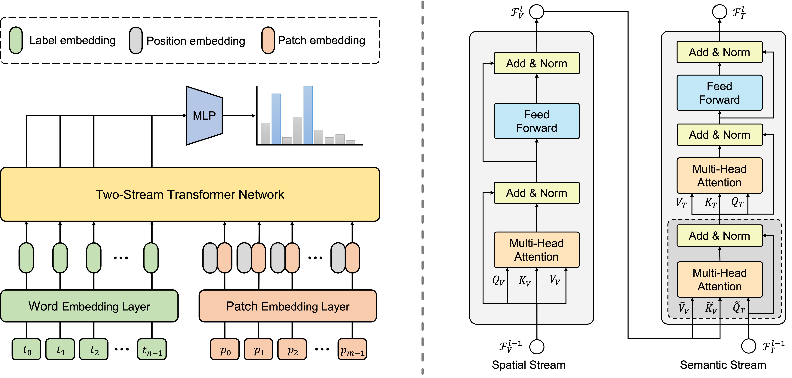

## Two-Stream Transformer for Multi-Label Image Classification

### Introduction
This is a official PyTorch implementation of Two-Stream Transformer for Multi-Label Image Classification.


Pre-trained weights can be found in [google drive](https://drive.google.com/drive/folders/1XOiLTpWHYRGR8itp4aqQZsbXWHV_TT0j?usp=sharing). Download them and put them in the `experiments` folder, then one can use follow command to reproduce results reported in paper.

```bash
python evaluate.py --exp experiments/TSFormer_mscoco/exp1    # Microsoft COCO
python evaluate.py --exp experiments/TSFormer_nuswide/exp1   # NUS-WIDE
python evaluate.py --exp experiments/TSFormer_voc2007/exp1   # Pascal VOC 2007
```

### Main Results
|  dataaset   | mAP  |
|  ---------  | ---- |
| VOC 2007    | 97.0 |
| MS-COCO     | 88.9 |
| NUS-WIDE    | 69.3 |